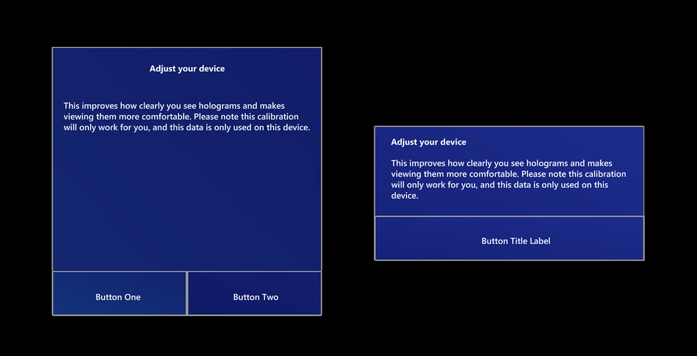

# Dialog

Dialog controls are UI overlays that provide contextual app information. They often request some kind of action from the user. Use dialogs to notify users of important information or to request confirmation or additional info before an action can be completed.

 

---

## Dialog in MRTK (Mixed Reality Toolkit) for Unity
MRTK provides dialog control in three sizes with one or two button options. You can also specify the placement distance for near or far interaction range. 

- DialogSmall_192x96.prefab: 192x96mm
- DialogMedium_192x128.prefab: 192x128mm
- DialogLarge_192x192.prefab: 192x192mm

* Please see [MRTK - Dialog](https://microsoft.github.io/MixedRealityToolkit-Unity/Assets/MRTK/SDK/Experimental/Dialog/README_Dialog.html) for more details.

 

---

## See also

* [Cursors](cursors.md)
* [Hand ray](point-and-commit.md)
* [Button](button.md)
* [Interactable object](interactable-object.md)
* [Bounding box and App bar](app-bar-and-bounding-box.md)
* [Manipulation](direct-manipulation.md)
* [Hand menu](hand-menu.md)
* [Near menu](near-menu.md)
* [Object collection](object-collection.md)
* [Voice command](voice-input.md)
* [Keyboard](keyboard.md)
* [Tooltip](tooltip.md)
* [Slate](slate.md)
* [Slider](slider.md)
* [Shader](shader.md)
* [Billboarding and tag-along](billboarding-and-tag-along.md)
* [Displaying progress](progress.md)
* [Surface magnetism](surface-magnetism.md)
